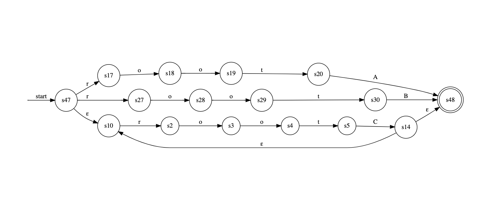

# regex2dfa

Convert Regular Expression into DFA (Deterministic Finite Automaton).



To convert NFA (Nondeterministic Finite Automaton) to DFA is under developping.

## Setup

```sh
$ git clone https://github.com/basd4g/regex2dfa.git
$ cd regex2dfa
$ npm i
```
## Usage

```sh
$ npm start -- '(rootA|rootB|(rootC)*)'
```

Print codes to draw a automaton of [Graphviz](http://graphviz.org/).

Try to draw on [viz-js.com](http://viz-js.com/).

## Input Format

```
<[input string]>
      means <S>

<S>   means <S> <S>
      or    ( <S'> )
      or    ( <S'> )*
      or    <c>

<S'>  means <S'> <S'>
      or    <S>
      or    <S> | <S>

<c>   means <[charactor]>
      or    <[charactor]>*
```
 
### example


- `hoge`
- `hoge(fuga|hoge)`
- `hoge*`
- `(hoge)*`
- `(hoge|fuga)*`
- `hoge(hoge(hoge)((fuga)*hoge))`

## ToDo

- [ ] NFA -> DFA
- [ ] Draw a automaton on the browser
- [ ] deal with POSIX Regular Expression
